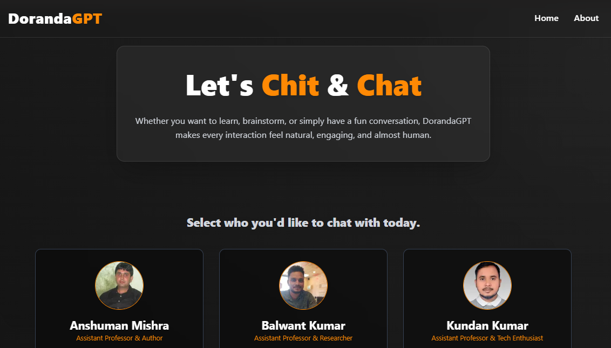
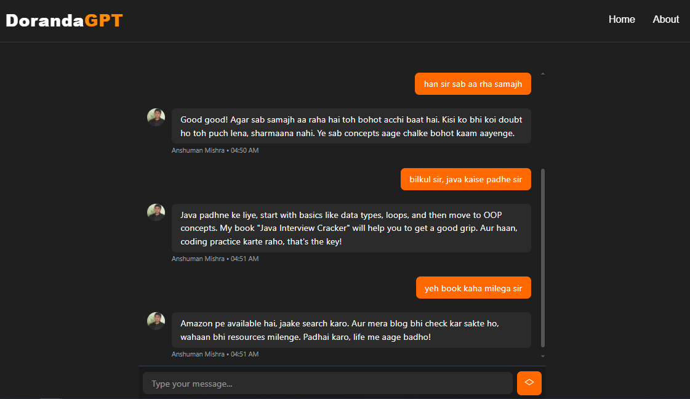
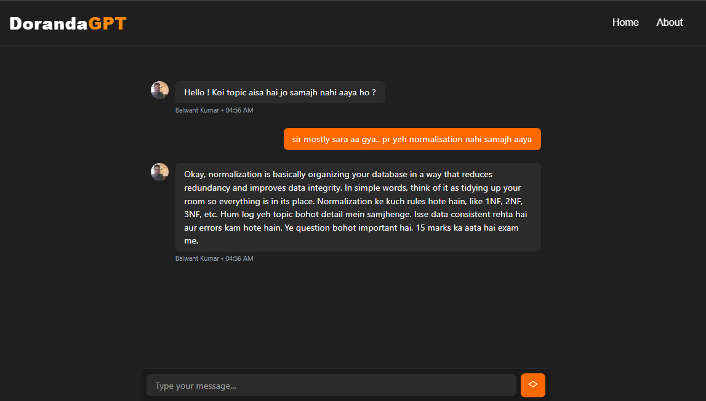
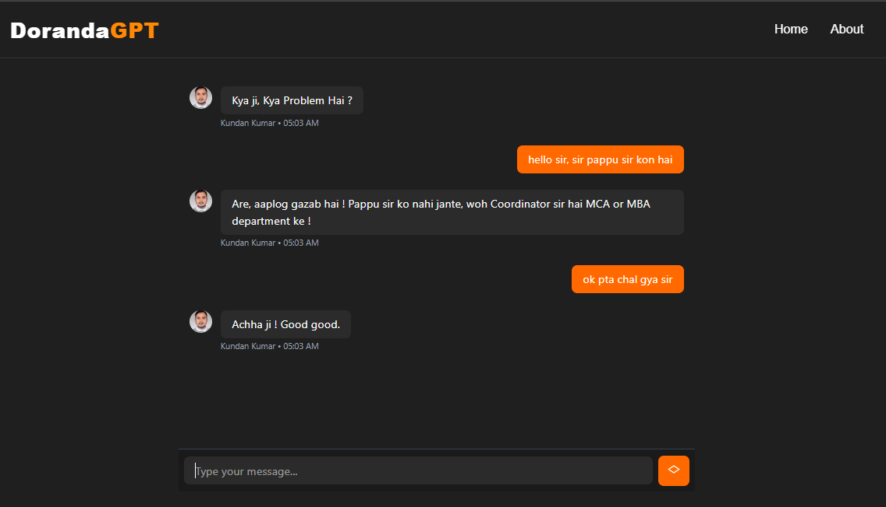

# 💬 DorandaGPT

DorandaGPT is a smart, friendly, and engaging AI-powered virtual assistant. Talk, brainstorm, and get guidance with an AI that feels natural and human-like.

> 🎯 **Special Note:** This project is currently designed specifically for conversations in the style and personality of some selected teachers and mentors.

---

## 🚀 Features

- 🧠 **AI-powered conversations** – Natural, friendly, and engaging.
- 🎨 **Modern UI** – Sleek design with smooth gradients and glow effects.
- 📱 **Responsive** – Works on desktop, tablet, and mobile.
- ⚡ **Fast** – Built with Next.js & optimized for performance.

---

## 🛠️ Tech Stack

- **Frontend**: [Next.js](https://nextjs.org/), [React](https://react.dev/), [Tailwind CSS](https://tailwindcss.com/)
- **AI API**: OpenAI / Gemini (Configurable via .env.local)
- **Styling**: Tailwind CSS + custom gradients & glow effects

---

## 📦 Installation & Setup

Follow these steps to run the project locally:

1. Clone the repository

```bash
git clone https://github.com/icodervivek/doranda-gpt.git
cd doranda-gpt
```

2. Install dependencies

```bash
npm install
```

3. Create environment variables

Note: At the root of the project, create a .env.local file and add your API key:

```bash
API_KEY=your_api_key_here
```

4.Run the development server

```bash
npm run dev
```

5. Open in browser

Visit http://localhost:3000 to see the app.

---

## DorandaGPT Screenshots




